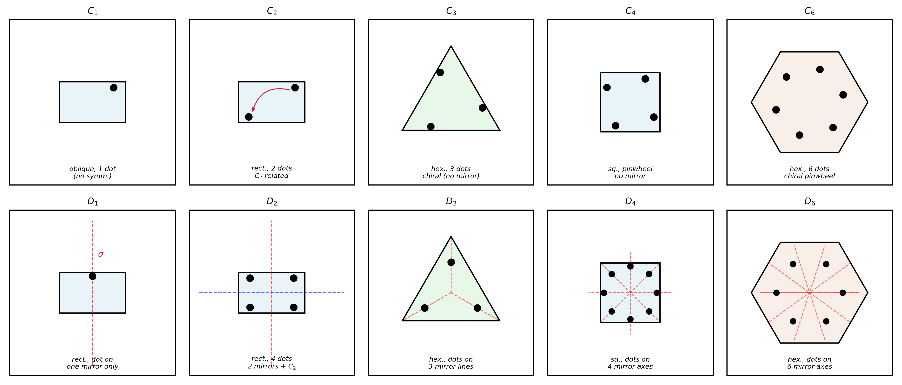

# 2D Crystallographic Point Groups — CMP Assignment

**Course:** Condensed Matter Physics  
**Topic:** Crystallography — 2D Point Groups (Schoenflies Notation)

---

## Assignment Question

> Look (in the web or book) for crystallographic point groups in 2D and come up with Schoenflies notation for each of them. You can think of squares or rectangles or hexagons placed at all Bravais lattice points. Think how will you shade them to allow the symmetries as we did in class for the dices. There are of course standard prescriptions but try this way.

---

## What this repo contains

```
├── Assignment.pdf            # Soutions
├── Assignment_Latex.tex      # LaTeX source of the full assignment
├── Fig-1.png                 # Figure 1 (300 dpi PNG) — upload to Overleaf
├── Fig-1.pdf                 # Figure 1 (vector PDF) — preferred for Overleaf
├── generate_fig1.py          # Python script that produces Fig-1.png / Fig-1.pdf
└── README.md                 # this file
```

---

## The core idea

In 2D, any rotation $R(\theta)$ that is a symmetry of a periodic lattice must map lattice vectors to lattice vectors. In the lattice basis $R$ is represented by an integer matrix, so its trace must be an integer:

$$2\cos\theta \in \mathbb{Z}$$

This forces $n \in \{1, 2, 3, 4, 6\}$ — the **crystallographic restriction theorem**. Five-fold, seven-fold etc. axes are incompatible with a periodic lattice.

Combining rotations and mirror reflections gives exactly **10 point groups** in 2D, listed in Schoenflies notation:

| Group | Rotations | Mirrors | Order | Lattice |
|-------|-----------|---------|-------|---------|
| $C_1$ | 1 | 0 | 1 | Oblique |
| $C_2$ | 2 | 0 | 2 | Oblique / Rectangular |
| $C_3$ | 3 | 0 | 3 | Hexagonal |
| $C_4$ | 4 | 0 | 4 | Square |
| $C_6$ | 6 | 0 | 6 | Hexagonal |
| $D_1$ | 1 | 1 | 2 | Rectangular |
| $D_2$ | 2 | 2 | 4 | Rectangular |
| $D_3$ | 3 | 3 | 6 | Hexagonal |
| $D_4$ | 4 | 4 | 8 | Square |
| $D_6$ | 6 | 6 | 12 | Hexagonal |

---

## The motif / shading method

The approach used here — same as the dice analogy from class — is:

1. Pick a **Bravais lattice** (oblique, rectangular, square, hexagonal).
2. Place a geometric **motif** (rectangle, square, triangle, hexagon) at every lattice point.
3. **Shade the motif** by placing dots on it:
   - Dots placed **off** all mirror lines → mirrors broken → cyclic group $C_n$
   - Dots placed **on** mirror lines symmetrically → mirrors preserved → dihedral group $D_n$

This way every subgroup of the lattice's maximum symmetry can be realised by choosing the shading appropriately.

**Figure 1** below illustrates all 10 groups using this construction.



*Top row: cyclic groups $C_1$–$C_6$ (rotation only, dots off mirror lines).  
Bottom row: dihedral groups $D_1$–$D_6$ (rotation + mirrors, dots on mirror axes shown as red dashed lines).*

---

## Reproducing the figure

The figure is generated by `generate_fig1.py` using standard Python scientific libraries.

**Requirements:**
```
python >= 3.8
matplotlib
numpy
```

Install dependencies if needed:
```bash
pip install matplotlib numpy
```

Run:
```bash
python generate_fig1.py
```

This produces both `Fig-1.png` (300 dpi raster) and `Fig-1.pdf` (vector). Either can be uploaded to Overleaf.

---

## Compiling on Overleaf

1. Upload `Assignment_Latex.tex`, and either `Fig-1.png` or `Fig-1.pdf` (PDF preferred — it scales without pixelation) into the **same folder** in your Overleaf project.
2. The `.tex` file uses `\graphicspath{{./}}` and `\includegraphics{Fig-1}`, so no path changes are needed.
3. Compile with **pdfLaTeX**.

To compile locally:
```bash
pdflatex Assignment_Latex.tex
pdflatex Assignment_Latex.tex   # run twice to resolve cross-references
```

---

## References

1. C. Kittel, *Introduction to Solid State Physics*, 8th ed., Wiley, 2005.
2. N. W. Ashcroft and N. D. Mermin, *Solid State Physics*, Holt Rinehart Winston, 1976.
3. C. J. Bradley and A. P. Cracknell, *The Mathematical Theory of Symmetry in Solids*, Clarendon Press, 1972.
4. G. Burns and A. M. Glazer, *Space Groups for Solid State Scientists*, 2nd ed., Academic Press, 1990.
5. C. Hammond, *The Basics of Crystallography and Diffraction*, 4th ed., OUP, 2015.
6. D. Shechtman, I. Blech, D. Gratias, J. W. Cahn, *Phys. Rev. Lett.* **53**, 1951 (1984).
7. J. D. Hunter, "Matplotlib: A 2D graphics environment", *Comput. Sci. Eng.* **9**(3), 90–95 (2007).
